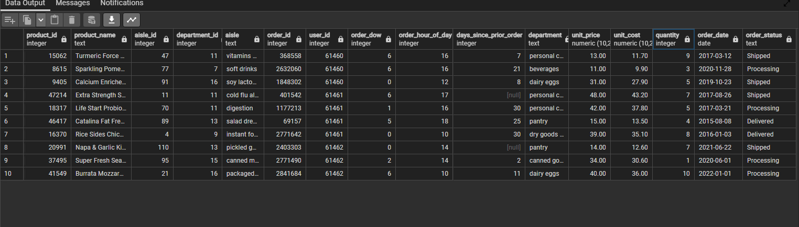

# InstaCart DB
# Denormalization of the InstaCart dataset &amp; Analysis
## by Kola Ademola
___

___
## INTRODUCTION
___
Instacart is an American delivery company that operates a grocery delivery and pick-up service in the United States and Canada. The company offers its services via a website and mobile app. The service allows customers to order groceries from participating retailers with the shopping being done by a personal shopper. This project is just focused on **DENORMALIZATION** of the Instacart orders dataset & some basic analysis
___
## DATA MODELLING
___
The initial dataset is a denormalized dataset; I will be denormalizing it to **3NF** brfore analysis
___DENORMALIZED DATASET___

