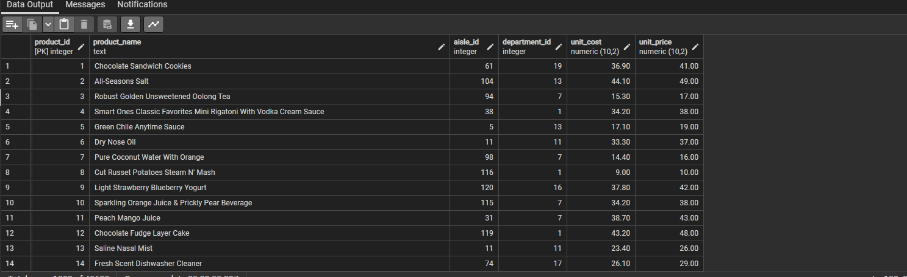
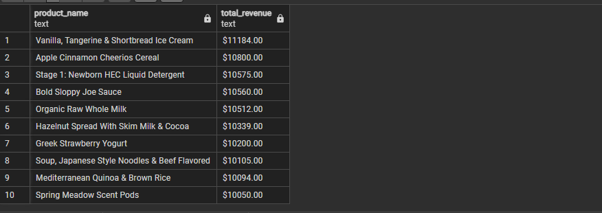

# InstaCart DB
# Denormalization of the InstaCart dataset &amp; Analysis
## by Kola Ademola
___

___
## INTRODUCTION
___
Instacart is an American delivery company that operates a grocery delivery and pick-up service in the United States and Canada. The company offers its services via a website and mobile app. The service allows customers to order groceries from participating retailers with the shopping being done by a personal shopper. This project is just focused on **DENORMALIZATION** of the Instacart orders dataset & some basic analysis
___
## SKILLS DEMONSTRATED
I used advanced SQL functions to import the dataset and normalized it, then I did some basic data analysis to query the database as well, all in PostgreSQL.  

### DENORMALIZATION PROCESS
For this project I started by creating a temporary table to hold the denormalized data first;

Then I imported the data from the **csv** into the temporary table I created.  
___QUERY___  

___RESULT___  

After importing the data I split it into 4 tables to acheive **3NF**
### AISLE TABLE
___QUERY___  
  
___RESULT___  
  
### DEPARTMENTS TABLE
___QUERY___  
  
___RESULT___  
  
### PRODUCTS TABLES
___QUERY___  
  
___RESULT___  
  
### ORDERS TABLE
___QUERY___  
  
___RESULT___  
  
___
## DATA MODELLING
___
The initial dataset is a denormalized dataset; I will be denormalizing it to **3NF** brfore analysis  
___DENORMALIZED DATASET___  

* The whole order details is in one table, I will break it down to 4 diffrent tables in the process of normalization or archieving **3NF**.   
* The result of normalization can be seen in this data model(**STAR SCHEMA**);  
___DATA MODEL___  

___
## DATA ANALYSIS & VISUALIZATIONS
____
I'll be using this database to solve some business problems that the owner of **Instacart** is interested in knowing and solving..

### PROBLEM STATEMENT
* Q1 What are the top-selling products by revenue, and how much revenue have they generated?  
___QUERY___  

___RESULT___  

> INSIGHT:::The top-selling product is the **"Vanilla, Tangerine & Shortbread Ice Cream"** with a total revenue of **$11,184.00**.
___
* Q2 Which products have the highest profit margin, and how much profit have they generated?  
___QUERY___  

___RESULT___  

> INSIGHT:::The top products with the most generated profit all have the same profit margin, with **"Vanilla, Tangerine & Shortbread Ice Cream"** at the top of list with **"$1,118.40"** total profit.
___
* Q3 Which aisles have the highest sales volume, and how does this vary by department?  
___QUERY___  

___RESULT___  

> INSIGHT:::The **"missing"** aisle has the highest overall sales volume with over **147,000** items sold
___
* Q4 What is the average order size (in terms of quantity and total cost) per day of the week?  
___QUERY___  

___RESULT___  

> INSIGHT:::The average order size & value is almost the same for most days of the week, but Fridays come out on top with **"6 orders per day"** and an AOV of **"$151.36"**.
___
* Q5 Which products are most commonly purchased together, and what is the frequency of these combinations?  
___QUERY___  

___RESULT___  

>
___
* Q6 What is the average time between orders for each user, and how does this vary by product category?  
___QUERY___  

___RESULT___  

>
___
* Q7 Which products have the highest rate of returns or customer complaints, and what are the common reasons?  
___QUERY___  

___RESULT___  

>
___
* Q8 What is the average unit cost and unit price for each product category, and how does this compare to industry benchmarks?  
___QUERY___  

___RESULT___  

>
___
* Q9 How have sales and revenue changed over time for each product category, and what factors have contributed to these changes?  
___QUERY___  

___RESULT___  

>
___
* Q10 Which users have the highest lifetime value, and what are their common purchase patterns and preferences?  
___QUERY___  

___RESULT___  

>
___

