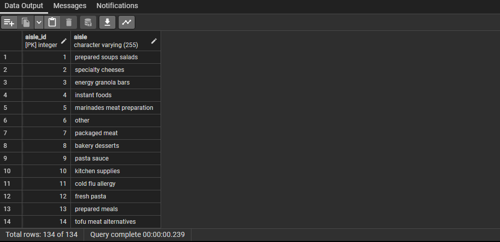

# InstaCart DB
# Denormalization of the InstaCart dataset &amp; Analysis
## by Kola Ademola
___

___
## INTRODUCTION
___
Instacart is an American delivery company that operates a grocery delivery and pick-up service in the United States and Canada. The company offers its services via a website and mobile app. The service allows customers to order groceries from participating retailers with the shopping being done by a personal shopper. This project is just focused on **DENORMALIZATION** of the Instacart orders dataset & some basic analysis
___
## SKILLS DEMONSTRATED
I used advanced SQL functions to import the dataset and normalized it all in PostgreSQL.  

### DENORMALIZATION PROCESS
For this project I started by creating a temporary table to hold the denormalized data first;

Then I imported the data from the **csv** into the temporary table I created.  
___QUERY___  

___RESULT___  

After importing the data I split it into 4 tables to acheive **3NF**
### AISLE TABLE
___QUERY___  
  
___RESULT___  
  
### DEPARTMENTS TABLE
___QUERY___  
  
___RESULT___  
  
### PRODUCTS TABLES
___QUERY___  
  
___RESULT___  
  
### ORDERS TABLE
___QUERY___  
  
___RESULT___  
  
___
## DATA MODELLING
___
The initial dataset is a denormalized dataset; I will be denormalizing it to **3NF** brfore analysis  
___DENORMALIZED DATASET___  

* The whole order details is in one table, I will break it down to 4 diffrent tables in the process of normalization or archieving **3NF**.   
* The result of normalization can be seen in this data model(**STAR SCHEMA**);  
___DATA MODEL___  

___
## DATA ANALYSIS & VISUALIZATIONS
____

